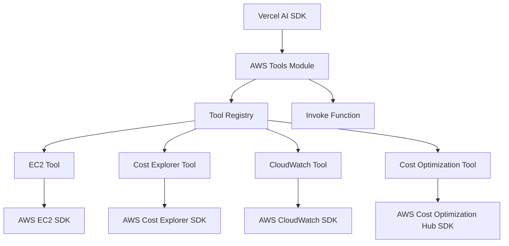

# Design Document

## Overview

The AWS Tools Integration is a TypeScript npm module that provides a standardized interface for accessing AWS services through the Vercel AI SDK. The module implements a plugin architecture where each AWS service is represented as a tool with consistent input/output schemas and error handling patterns.

The core design principle addresses the challenge of AWS APIs returning large datasets that could overflow LLM context windows. Each tool returns dual-format responses: human-readable summaries optimized for LLM consumption and structured JSON data suitable for charting and analysis.

## Architecture

### High-Level Architecture



### Module Structure

The module follows a modular architecture with clear separation of concerns:

- **Core Module** (`src/index.ts`): Exports tool registry and invoke function
- **Tool Interface** (`src/tool.ts`): Defines the contract for all AWS tools
- **Individual Tools** (`src/tools/`): Implements specific AWS service integrations
- **Utilities** (`src/logger.ts`): Provides logging capabilities
- **Tests** (`tests/`): Comprehensive test coverage for all tools

## Components and Interfaces

### Tool Interface

The `Tool` interface defines the contract that all AWS tools must implement:

```typescript
interface Tool {
  name: string;                    // Unique tool identifier
  description: string;             // Human-readable description
  inputSchema: object;             // JSON schema for input validation
  outputSchema: object;            // JSON schema for output structure
  configSchema?: object;           // Optional configuration schema
  defaultConfig?: object;          // Default configuration values
  invoke(input: any, config: ToolConfig): Promise<ToolOutput>;
}
```

### Configuration Interface

All tools accept a standardized configuration object:

```typescript
interface ToolConfig {
  credentials?: {
    accessKeyId: string;
    secretAccessKey: string;
    sessionToken?: string;
  };
  logger?: Logger;
}
```

### Output Interface

All tools return data in a consistent dual-format structure:

```typescript
interface ToolOutput {
  summary: string;                 // Human-readable summary for LLM context
  datapoints: any[];              // Structured data for charting/analysis
}
```

### Tool Registry

The tool registry maintains a collection of available tools and provides a unified invoke function:

```typescript
export const tools: Tool[] = [
  awsDescribeInstances,
  awsGetCostAndUsage,
  awsCloudWatchGetMetrics,
  awsCostOptimizationHubListRecommendations
];

export async function invoke(toolName: string, input: any, config: any): Promise<any>
```

## Data Models

### EC2 Instance Data Model

```typescript
interface EC2InstanceDatapoint {
  instanceId: string;
  instanceName: string;
  instanceType: string;
  platform: string;
  tenancy: string;
  region: string;
  uptimeHours: number;
  state: string;
  // Enriched data from additional API calls
  volumes?: {
    volumeId: string;
    size: number;
    volumeType: string;
    iops?: number;
    encrypted: boolean;
  }[];
  monthlyCost?: {
    compute: number;
    storage: number;
    dataTransfer: number;
    total: number;
  };
  reservationInfo?: {
    reservationId?: string;
    utilizationPercentage?: number;
    savingsAmount?: number;
  };
}
```

### Cost and Usage Data Model

```typescript
interface CostUsageDatapoint {
  date: string;
  dimensions: { [key: string]: string };
  amortizedCost: number;
  usageAmount: number;
}
```

### CloudWatch Metrics Data Model

```typescript
interface CloudWatchDatapoint {
  timestamp: string;
  value: number;
  unit: string;
  dimensions: { [key: string]: string };
}
```

### Cost Optimization Recommendation Data Model

```typescript
interface CostOptimizationDatapoint {
  recommendationId: string;
  type: string;
  description: string;
  estimatedMonthlySavings: number;
  resourceId: string;
  service: string;
}
```

## Error Handling

### Error Handling Strategy

The module implements a comprehensive error handling strategy with multiple layers:

1. **Input Validation**: JSON schema validation for all input parameters
2. **AWS SDK Error Handling**: Specific handling for AWS service errors
3. **Network Error Handling**: Retry logic and timeout handling
4. **Authentication Error Handling**: Clear guidance for credential issues
5. **Rate Limiting**: Automatic retry with exponential backoff

### Error Types and Responses

```typescript
interface ErrorResponse {
  error: string;
  code?: string;
  details?: any;
  guidance?: string;
}
```

Common error scenarios:
- **InvalidCredentials**: Provides credential setup guidance
- **InsufficientPermissions**: Lists required IAM permissions
- **InvalidRegion**: Suggests valid regions
- **RateLimitExceeded**: Implements retry logic
- **ResourceNotFound**: Clear resource identification

### Credential Resolution Chain

The module supports multiple credential sources in order of precedence:

1. Direct configuration object
2. Environment variables (`AWS_ACCESS_KEY_ID`, `AWS_SECRET_ACCESS_KEY`)
3. AWS credentials file (`~/.aws/credentials`)
4. IAM roles (for EC2/ECS environments)

## Testing Strategy

### Test Architecture

The testing strategy ensures reliability and maintainability:

- **Unit Tests**: Individual tool functionality testing
- **Integration Tests**: AWS SDK integration testing with mocked responses
- **Schema Validation Tests**: Input/output schema compliance
- **Error Handling Tests**: Comprehensive error scenario coverage

### Test Structure

```
tests/
├── setup.ts                    # Test environment setup
├── common.ts                   # Shared test utilities
├── awsDescribeInstances.test.ts
├── awsGetCostAndUsage.test.ts
├── awsCloudWatchGetMetrics.test.ts
└── awsCostOptimizationHubListRecommendations.test.ts
```

### Test Coverage Areas

1. **Functional Testing**: Verify tool outputs match expected formats
2. **Schema Validation**: Ensure input/output compliance with JSON schemas
3. **Error Handling**: Test all error scenarios and response formats
4. **Configuration Testing**: Verify credential resolution and configuration handling
5. **Summary Generation**: Test heuristics for human-readable summaries

## Implementation Details

### Summary Generation Heuristics

Each tool implements tailored heuristics for generating human-readable summaries:

- **EC2 Tool**: Aggregates instance counts, states, types, and average uptime
- **Cost Tool**: Summarizes spending trends, top cost drivers, and period comparisons
- **CloudWatch Tool**: Highlights metric trends, anomalies, and key statistics
- **Cost Optimization Tool**: Prioritizes recommendations by potential savings

### Data Processing Pipeline

1. **Input Validation**: Validate against JSON schema
2. **Primary AWS API Call**: Execute main AWS SDK command with pagination handling
3. **Linked Data Retrieval**: Execute additional AWS API calls for related information
4. **Data Aggregation**: Merge and enrich primary data with linked information
5. **Data Transformation**: Convert aggregated AWS response to standardized format
6. **Summary Generation**: Apply tool-specific heuristics on enriched dataset
7. **Output Formatting**: Return dual-format response

#### Multi-Call Data Enrichment Examples

- **EC2 Tool**: 
  - Primary: `DescribeInstances` for instance details
  - Secondary: `DescribeVolumes` for storage information
  - Tertiary: Cost Explorer API for per-instance cost breakdown
  - Aggregation: Merge volume data and cost data with instance records

- **Cost Tool**:
  - Primary: `GetCostAndUsage` for cost data
  - Secondary: `GetReservationCoverage` for reservation utilization
  - Tertiary: `GetSavingsPlansUtilization` for savings plans data
  - Aggregation: Enrich cost data with utilization metrics

- **CloudWatch Tool**:
  - Primary: `GetMetricData` for metric values
  - Secondary: `DescribeAlarms` for related alarms
  - Tertiary: `GetMetricStatistics` for historical context
  - Aggregation: Combine metrics with alarm states and trends

### Performance Considerations

- **Lazy Loading**: AWS SDK clients are instantiated per request
- **Connection Pooling**: Reuse HTTP connections where possible
- **Data Pagination**: Handle large result sets efficiently
- **Memory Management**: Stream large datasets when possible
- **Parallel API Calls**: Execute independent secondary calls concurrently
- **Graceful Degradation**: Return partial data if secondary calls fail
- **Caching Strategy**: Cache expensive secondary data for short periods
- **Timeout Management**: Set appropriate timeouts for multi-call operations

## Security Considerations

### Credential Security

- Never log or expose AWS credentials
- Support secure credential sources (IAM roles, environment variables)
- Validate credential format before use
- Clear credentials from memory after use

### Input Validation

- Strict JSON schema validation for all inputs
- Sanitize user-provided filters and parameters
- Prevent injection attacks through parameter validation
- Limit result set sizes to prevent resource exhaustion

### Output Sanitization

- Remove sensitive information from summaries
- Sanitize resource identifiers in error messages
- Limit detailed error information in production
- Ensure consistent error response formats